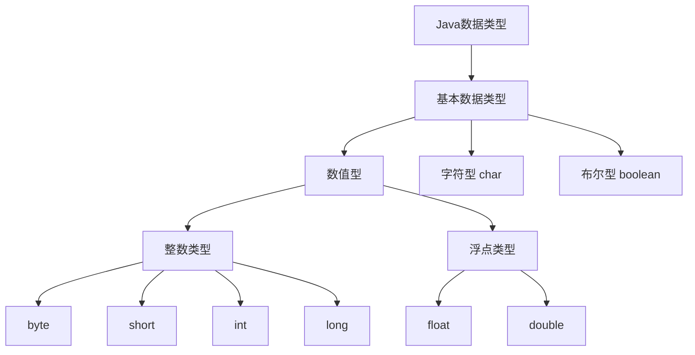

# Java 基本数据类型

Java 语言提供了 **8 种** 基本数据类型（Primitive Data Types），它们是 Java 语言中最基础的数据单元，用于存储简单的数值、字符和布尔值。

## 一、分类图解



## 二、详细列表

| 类型 | 描述 | 大小 (位/字节) | 范围 | 默认值 |
| :--- | :--- | :--- | :--- | :--- |
| **byte** | 字节型 | 8 bit / 1 byte | -128 ~ 127 | 0 |
| **short** | 短整型 | 16 bit / 2 bytes | -32768 ~ 32767 | 0 |
| **int** | 整型 | 32 bit / 4 bytes | -2^31 ~ 2^31-1 | 0 |
| **long** | 长整型 | 64 bit / 8 bytes | -2^63 ~ 2^63-1 | 0L |
| **float** | 单精度浮点型 | 32 bit / 4 bytes | 约 ±3.40282347E+38F | 0.0f |
| **double** | 双精度浮点型 | 64 bit / 8 bytes | 约 ±1.79769313486231570E+308 | 0.0d |
| **char** | 字符型 | 16 bit / 2 bytes | \u0000 ~ \uffff | '\u0000' |
| **boolean** | 布尔型 | 1 bit (逻辑上) | true / false | false |

## 三、代码示例

```java
public class PrimitiveTypesDemo {
    public static void main(String[] args) {
        // 1. 整数型
        byte b = 100;
        short s = 1000;
        int i = 100000;
        long l = 100000L; // long 类型建议以 L 结尾

        // 2. 浮点型
        float f = 234.5f; // float 类型必须以 f 结尾
        double d = 123.4;

        // 3. 字符型
        char c = 'A';

        // 4. 布尔型
        boolean bool = true;

        System.out.println("int 最小值: " + Integer.MIN_VALUE);
        System.out.println("int 最大值: " + Integer.MAX_VALUE);
    }
}
```

## 四、关键点总结

1.  **自动类型转换**：容量小的数据类型可以自动转换为容量大的数据类型（例如 `int` 转 `long`，`long` 转 `float`）。
2.  **强制类型转换**：容量大的数据类型转换为容量小的数据类型时，需要使用强制转换符 `()`，可能会导致精度丢失或溢出。
3.  **boolean**：`boolean` 类型不能转换为其他任何数据类型。
4.  **默认类型**：Java 中整型常量默认为 `int`，浮点型常量默认为 `double`。
