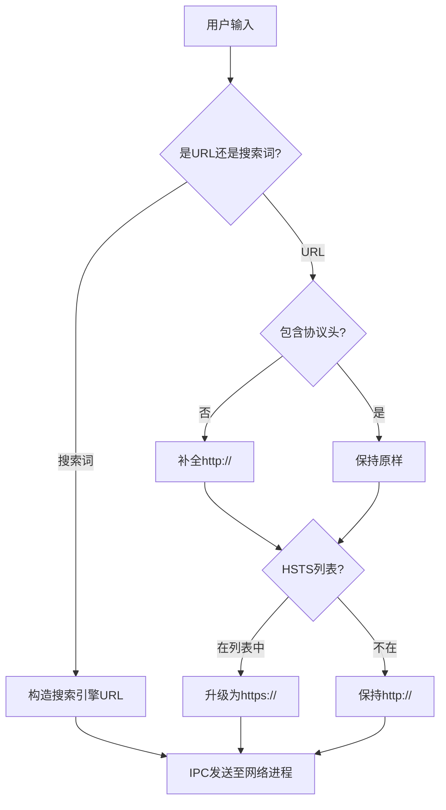
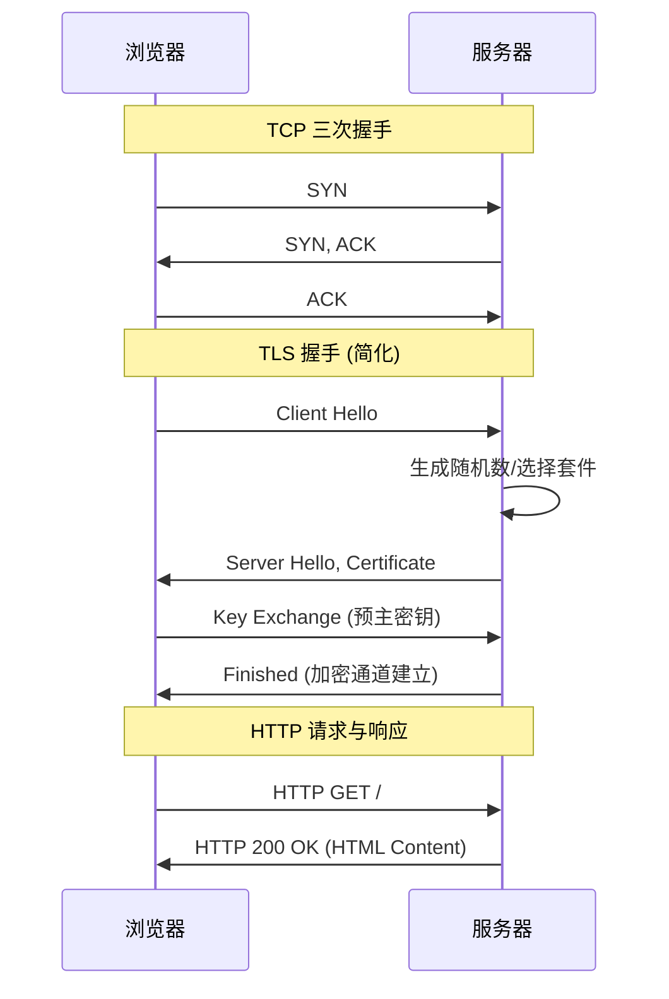
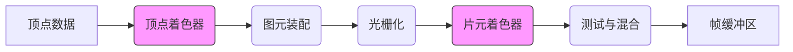

# 从输入 URL 到页面展示：全链路深度解析

这是一个经典的前端面试题，涵盖了网络通信、浏览器渲染、JavaScript 执行等多个核心领域。本文将从 **浏览器预处理**、**网络通信**、**页面渲染**、**WebGL 渲染管线** 以及 **WebRTC 实时通信** 五个维度，深度剖析这一过程。

## 一、浏览器预处理：幕后的第一步

在数据真正发送到网络之前，浏览器（Browser Process）已经在幕后完成了大量工作。

### 1. 输入解析与合法性检查
当你在地址栏输入内容时，浏览器并不会立即发起请求，而是进行以下解析：
*   **搜索 vs URL**：浏览器会判断输入内容是否符合 URL 规则（如包含协议头、合法域名字符、端口号等）。
    *   如果不符合 URL 规则（例如输入 "javascript closure"），浏览器会将输入内容作为搜索关键词，拼接默认搜索引擎的查询 URL（如 `https://www.google.com/search?q=javascript+closure`）。
    *   如果符合 URL 规则，则进入下一步。
*   **字符编码**：如果 URL 中包含非 ASCII 字符（如中文域名），浏览器会对其进行 Punycode 编码（如 `中文.com` -> `xn--fiq228c.com`）。



### 2. 自动补全与协议适配
为了提升用户体验，浏览器会自动补全部分信息：
*   **协议补全**：如果用户仅输入 `google.com`，浏览器默认会补全 `http://` 协议头。
*   **HSTS 升级**：浏览器会检查该域名是否在 **HSTS (HTTP Strict Transport Security)** 预加载列表中。如果存在，浏览器会将 `http://` 强制替换为 `https://`，确保从第一次请求开始就是加密传输，防止降级攻击。

> **Tips: 安全浏览检查**
> 
> 在发起网络请求前，浏览器还可能比对本地的“安全浏览列表”（Safe Browsing List），检查该 URL 是否属于已知的钓鱼网站或恶意软件站点。如果命中，浏览器会直接拦截请求并显示红色警告页面。

### 3. 进程间通信 (IPC)
一旦 URL 解析完成，**浏览器主进程 (Browser Process)** 会通过 IPC (Inter-Process Communication) 将 URL 请求发送给 **网络进程 (Network Process)**，由网络进程接管后续的资源下载任务。

## 二、网络通信阶段：数据的旅程

网络进程接管后，数据开始在网络世界中漫游。

### 1. DNS 解析与 IP 寻址
浏览器首先需要将域名解析为 IP 地址。
*   **查找缓存**：浏览器缓存 -> 系统缓存 (hosts) -> 路由器缓存 -> ISP DNS 缓存。
*   **递归/迭代查询**：如果缓存未命中，向根域名服务器、顶级域名服务器发起查询，最终获取目标服务器 IP。

### 2. TCP 与 TLS 握手
获取 IP 后，浏览器与服务器建立连接。

*   **TCP 三次握手**：确保连接可靠性（SYN -> SYN+ACK -> ACK）。
*   **TLS 四次握手 (HTTPS)**：确保通信安全（Client Hello -> Server Hello -> Key Exchange -> Finished）。



## 三、页面渲染阶段：构建可视世界

浏览器接收到 HTML 响应后，渲染引擎（Renderer Process）开始工作。

### 渲染流水线
1.  **解析 HTML**：构建 DOM 树。
2.  **解析 CSS**：构建 CSSOM 树。
3.  **构建渲染树 (Render Tree)**：结合 DOM 和 CSSOM，剔除不可见节点（如 `display: none`）。
4.  **布局 (Layout/Reflow)**：计算每个节点在屏幕上的确切位置和大小。
5.  **绘制 (Paint)**：将渲染树节点转换为像素，填充颜色、边框等。
6.  **合成 (Composite)**：将不同图层（Layer）合成到一起，最终显示在屏幕上。

## 四、进阶渲染：WebGL 渲染管线

如果页面包含 `<canvas>` 并使用 WebGL 上下文（如 Three.js），渲染过程将由 CPU 转移到 GPU。

### GPU 处理流程
1.  **顶点着色器**：坐标变换。
2.  **图元装配**：组装三角形。
3.  **光栅化**：几何转像素。
4.  **片元着色器**：像素着色。
5.  **测试与混合**：深度测试与颜色混合。



## 五、实时通信：WebRTC 的幕后

如果页面涉及视频会议，WebRTC 协议栈将介入建立 **P2P 连接**。

1.  **信令 (Signaling)**：交换 SDP。
2.  **ICE 穿透**：通过 STUN/TURN 获取公网 IP。
3.  **DTLS 握手**：建立加密通道。
4.  **SRTP 传输**：传输音视频流。

```javascript
// WebRTC 核心建立代码
const pc = new RTCPeerConnection({
  iceServers: [{ urls: 'stun:stun.l.google.com:19302' }]
});

// 监听 ICE 候选
pc.onicecandidate = event => {
  if (event.candidate) sendToPeer('candidate', event.candidate);
};

// 建立连接
const offer = await pc.createOffer();
await pc.setLocalDescription(offer);
sendToPeer('offer', offer);
```

## 六、关键技术总结

| 阶段 | 核心技术 | 关键作用 |
| :--- | :--- | :--- |
| **预处理** | IPC, HSTS | 输入智能修正、强制安全连接 |
| **网络** | DNS, TCP, TLS | 建立安全可靠的数据通道 |
| **渲染** | DOM, CSSOM, Paint | 将代码转化为静态像素 |
| **GPU** | WebGL, Shader | 高性能 3D 图形计算 |
| **实时** | WebRTC, ICE, UDP | 低延迟 P2P 音视频传输 |
