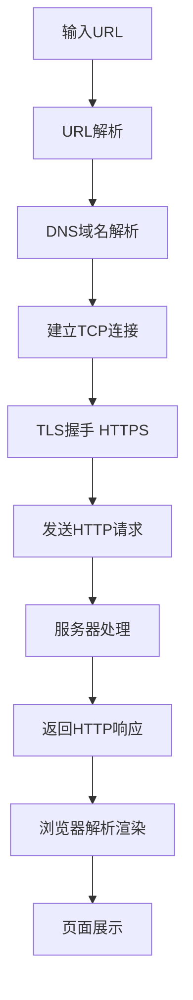
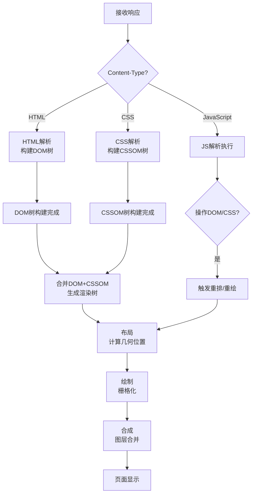

*从输入URL到页面展示全流程详解*

## 一、核心流程图


## 二、详细步骤解析

### 阶段1：URL解析与预处理

**URL结构分析**
```javascript
https://www.example.com:443/path/page?query=1#section
├── 协议: https
├── 主机名: www.example.com
├── 端口: 443 (默认)
├── 路径: /path/page
├── 查询参数: query=1
└── 片段标识: #section
```
**浏览器预处理**
- 检查URL合法性
- 判断是否为有效协议（http/https/ftp等）
- 自动补全（如省略协议自动加http://）
- 安全策略检查（HSTS预加载列表）

### 阶段2：DNS域名解析
DNS查询顺序（缓存优先）：
```text
浏览器DNS缓存 → 操作系统缓存 → hosts文件 → 
本地DNS服务器 → 递归查询 → 根DNS → 
TLD DNS → 权威DNS → 返回IP
```
查询过程：
```python
# 示例：查询 www.example.com
1. 查询本地缓存（命中则返回）
2. 操作系统查询（gethostbyname）
3. 向配置的DNS服务器（如8.8.8.8）发起查询
4. 迭代查询过程：
   - 问根DNS：com域在哪里？
   - 问.com TLD：example.com的权威DNS是谁？
   - 问权威DNS：www.example.com的IP是多少？
5. 返回IP地址（如93.184.216.34）并缓存
```

### 阶段3：建立网络连接

### 1. TCP三次握手
```bash
客户端 → SYN(seq=x) → 服务器     # Step 1
客户端 ← SYN-ACK(seq=y, ack=x+1) ← 服务器  # Step 2  
客户端 → ACK(ack=y+1) → 服务器     # Step 3
```

### 2. TLS握手（HTTPS场景）
```text
ClientHello
    ↓
ServerHello + Certificate
    ↓
Key Exchange + ChangeCipherSpec
    ↓
Encrypted Handshake Message
```
- TLS 1.2：2个RTT（往返延迟）
- TLS 1.3：优化为1个RTT

### 阶段4：发送HTTP请求
**请求报文结构：**
```http
GET /index.html HTTP/1.1           # 请求行Host: www.example.com              # 请求头User-Agent: Mozilla/5.0Accept: text/htmlConnection: keep-alive
                                    # 空行分隔
name=value&age=25                  # 请求体（POST时有）
```
**协议栈封装过程：**
```text
应用层: HTTP数据
    ↓ 加TCP头（端口、序列号、窗口大小）
传输层: TCP Segment
    ↓ 加IP头（源IP、目标IP、TTL）
网络层: IP Packet  
    ↓ 加MAC头（源MAC、目标MAC、通过ARP获取）
链路层: Ethernet Frame
    ↓ 转换为电信号/光信号
物理层: 网络传输
```

### 阶段5：服务器处理
**服务器架构：**
```text
客户端请求
    ↓
负载均衡器（Nginx/LVS）
    ↓
Web服务器（Apache/Nginx）
    ↓
应用服务器（Tomcat/Node.js）
    ↓
数据库/缓存（MySQL/Redis）
    ↓
返回响应数据
```
**服务器响应示例：**
```http
HTTP/1.1 200 OK                    # 状态行Content-Type: text/html; charset=utf-8Content-Length: 1256Cache-Control: max-age=3600Set-Cookie: session_id=abc123
                                    # 空行分隔
<!DOCTYPE html>                    # 响应体
<html><body>...</body></html>
```

### 阶段6：浏览器渲染（关键路径）

**详细渲染流程：**

**构建DOM树**
```javascript
// 解析HTML字节流 → 字符 → 令牌 → 节点 → DOM树
// 遇到<script>时可能阻塞解析
```
**构建CSSOM树**
```css
/* CSS规则具有层叠性和继承性 */
body { font-size: 16px; }      /* 父规则 */
.content { color: #333; }      /* 子规则继承 */
```
**构建渲染树**

- 组合DOM和CSSOM
- 排除不可见元素（display:none）

**布局（Layout/Reflow）**
- 计算每个节点的精确位置和尺寸
- 基于盒模型计算

**绘制（Paint）**
```javascript
// 分为多个图层
// 绘制顺序：背景色 → 背景图片 → 边框 → 子节点
```
**合成（Composite）**

- 将各图层合成为最终图像
- GPU加速合成

### 阶段7：加载子资源
```javascript
// 解析过程中遇到外部资源
      // 图片资源
<link rel="stylesheet">    // CSS资源
<script src="app.js">      // JS资源
// 浏览器行为：
// 1. 发现资源标签
// 2. 发起新的HTTP请求（可能复用TCP连接）
// 3. 根据优先级加载（CSS高优先级，图片低优先级）
// 4. 可能触发重新渲染
```

## 三、性能优化关键点

### 1. DNS优化
```html
<!-- DNS预获取 --><link rel="dns-prefetch" href="//cdn.example.com">
<!-- 减少DNS查询次数 --><!-- 使用较少的域名，但注意HTTP/1.1的并发限制 -->
```

### 2. 网络连接优化
```nginx
# 服务器配置keepalive_timeout 65;      # 保持TCP连接gzip on;                   # 压缩响应
```

### 3. 渲染优化
```javascript
// 减少重排重绘// 坏实践：逐个修改样式
element.style.width = '100px';
element.style.height = '200px';
// 好实践：批量修改
element.classList.add('new-style');
// 使用transform和opacity触发合成层（GPU加速）
element.style.transform = 'translateX(100px)';
```

### 4. 资源加载优化
```html
<!-- 异步加载非关键JS --><script async src="analytics.js"></script>
<!-- 延迟加载 -->
<!-- 预加载关键资源 --><link rel="preload" href="critical.css" as="style">
```

## 四、现代浏览器优化特性

### 1. HTTP/2 多路复用
```text
HTTP/1.1: 多个请求需要多个TCP连接
HTTP/2: 单个连接上并行多个请求/响应
```

### 2. 预连接与预加载
```html
<!-- 预连接 --><link rel="preconnect" href="https://api.example.com">
<!-- 预加载关键资源 --><link rel="preload" href="font.woff2" as="font">
```

### 3. 缓存策略

浏览器缓存层级：
Memory Cache → Service Worker Cache → 
Disk Cache → Push Cache → 网络请求

## 五、故障排查思路
当页面加载缓慢时，按顺序检查：

**本地问题**
- DNS查询时间（nslookup）
- TCP连接时间（ping/traceroute）

**网络问题**
- 带宽限制
- 丢包率（ping -n）
- CDN可用性

**服务器问题**
- 响应时间（TTFB）
- 服务器负载（监控指标）
- 数据库查询效率

**前端问题**
- 资源文件大小（压缩优化）
- 渲染阻塞（CSS/JS优化）
- 重排重绘（性能面板分析）

## 六、实际案例：淘宝首页加载过程

1. 输入URL：https://www.taobao.com

2. DNS：解析到CDN边缘节点（就近原则）

3. 连接：TCP+TLS握手（TLS 1.3优化）

4. 请求：获取基础HTML框架

5. 渲染：渐进式渲染，先显示骨架屏

6. 加载：并行加载CSS、JS、图片资源

7. 交互：加载完成后绑定事件

8. 缓存：Service Worker缓存关键资源

## 总结
从输入URL到页面展示是一个涉及**网络、系统、应用、渲染**多个层面的复杂过程。理解这个流程有助于：

1. **系统设计：** 设计高可用、高性能的Web应用

2. **性能优化：** 准确定位瓶颈，针对性优化

3. **故障排查：** 系统性分析问题原因

4. **技术选型：** 合理选择协议、框架、工具

整个过程就像快递配送：**包装（封装）→ 分拣（路由）→ 运输（传输）→ 拆包（解析）→ 使用（渲染）**，每个环节都可能影响最终的用户体验。

